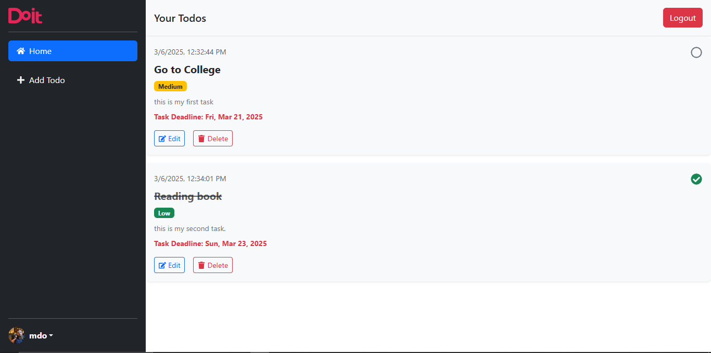
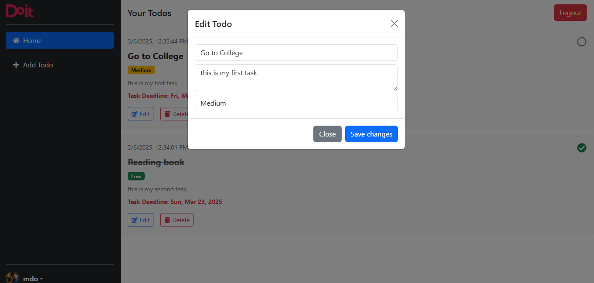

# Todo App

A simple **Todo Application** built with **React, Redux, and Bootstrap**, allowing users to add, edit, delete, mark tasks as complete, and prioritize their todos.

## 🚀 Live Demo
[Click Here to View Live](https://advanced-todoapp.vercel.app/)

## 📌 Features
- ✅ Add new todos with title, description, and priority.
- ✏ Edit existing todos.
- ❌ Delete todos.
- ✔ Mark todos as **complete/incomplete**.
- 🎨 Priority labels (**High, Medium, Low**).
- 🗄 Data managed with **Redux Toolkit**.
- 💾 Todos and user data stored in **LocalStorage**.
- 🔒 **Protected Routes** (default username: `admin`, password: `password`).
- 💡 Responsive UI with **Bootstrap**.

## 📸 Screenshots

### Todo List View


### Edit Todo Modal


## 🛠 Tech Stack
- **Frontend**: React.js, Redux Toolkit, Bootstrap
- **State Management**: Redux
- **Storage**: LocalStorage
- **Authentication**: Basic Protected Route
- **Icons**: React Icons
- **Deployment**: Vercel 

## 🔧 Installation & Setup
Follow these steps to set up the project locally.

### 1️⃣ Clone the Repository
```sh
git clone https://github.com/ankitjhagithub21/advanced-todoapp.git
cd advanced-todoapp
```

### 2️⃣ Install Dependencies
```sh
npm install
```

### 3️⃣ Run the Application
```sh
npm run dev
```
- The app will be available at **http://localhost:5173/**


## 🏗 Project Structure
```
├── src
│   ├── components
│   │   ├── Todos.jsx
│   │   ├── Sidebar.jsx
│   │   ├── Topbar.jsx
│   │   ├── EditModal.jsx
│   ├── redux
│   │   ├── store.js
│   │   ├── slices
│   │   │   ├── appSlice.js
│  
│   ├── App.jsx
│   ├── main.jsx
│
├── public
│   ├── index.html
│
├── package.json
├── README.md
```

## 🤝 Contributing
1. Fork the repository
2. Create a new branch: `git checkout -b feature-name`
3. Commit changes: `git commit -m 'Added new feature'`
4. Push the branch: `git push origin feature-name`
5. Open a Pull Request

## 📜 License
This project is licensed under the **MIT License**.

---

🚀 **Developed by Ankit Jha**